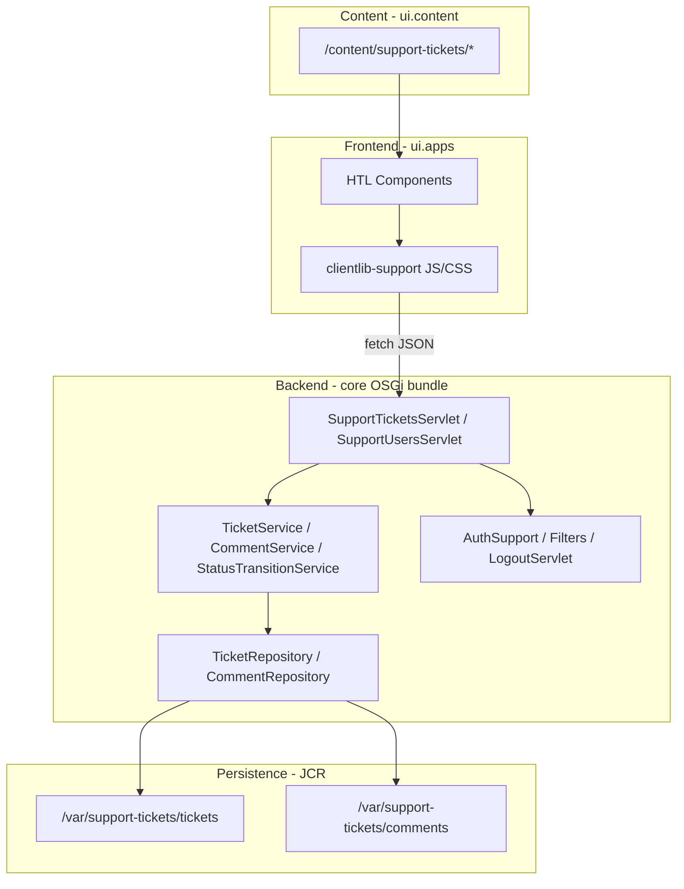

# Design Notes

## Architecture Overview (frontend, backend, database)

Layers:
- **Frontend:** AEM pages + HTL components (`ticket-list`, `ticket-form`, `ticket-detail`, `login`, `user-bar`) and `support.tickets` clientlib.
- **Backend:** Sling servlets at `/bin/api/support/*`, domain services, validation, state machine, auth filters.
- **Database:** JCR nodes under `/var/support-tickets` (repoinit-created, not in `ui.content`).

## Frontend Design

- **Pages:** `/content/support-tickets` (list), `/create`, `/detail`, `/login`.
- **Components:** Each ticket view is a dedicated HTL component with Sling Model for authored paths (`createPagePath`, `detailPagePath`, etc.).
- **Clientlibs:** Loaded at page level via `customheaderlibs.html` (CSS) and `customfooterlibs.html` (JS, synchronous).
- **API client:** `support-api.js` wraps `fetch` with credentials; redirects to login on `401`.
- **Init pattern:** `SupportUi.onReady()` ensures JS runs after create→detail navigation even when script loads late.
- **Auth UI:** Login form posts to `/content/support-tickets/login/j_security_check`. User bar shows signed-in user and Sign Out link.

## Backend Design

| Layer | Responsibility |
|---|---|
| `SupportTicketsServlet` | REST-style routing via selectors: collection, ticket, status, comments |
| `SupportUsersServlet` | List assignable AEM users |
| `TicketService` / `CommentService` | Business orchestration, validation delegation |
| `StatusTransitionService` | Authoritative transition map |
| `TicketValidator` | Required fields, enums, user existence |
| `TicketRepository` / `CommentRepository` | JCR CRUD under `/var/support-tickets` |
| `AuthSupport` | Reject `anonymous` on API |
| `SupportAuthRedirectFilter` | Publish-only HTML redirect to login |
| `SupportLogoutServlet` | Page selector `logout` → `Authenticator.logout()` |

**API base:** `/bin/api/support`  
**Error model:** `SupportApiException` → JSON `{ code, message, fields? }`

## Database Design

See [database/schema-or-migrations/jcr-schema.md](database/schema-or-migrations/jcr-schema.md).

- **Tickets:** `/var/support-tickets/tickets/{uuid}` — properties: title, description, priority, status, assignedTo, createdBy, createdAt, updatedAt.
- **Comments:** `/var/support-tickets/comments/{uuid}` — properties: ticketId, message, createdBy, createdAt.
- **Users:** AEM User Management (not duplicated in `/var`).
- **ACL:** Repoinit grants `support-agents`, `support-managers`, `administrators` read/write on `/var/support-tickets`.
- **Content ACL/CUG:** `ui.content` sets CUG on `/content/support-tickets` and read policies for support groups.

**Note:** Author and publish are separate JCR instances; ticket data in `/var` is not replicated by default. Use publish as the ticket runtime.

## Validation Strategy

- **Server-side only** for business rules (required fields, priority enum, assignee existence, transitions).
- `TicketValidator` returns field-level errors → `ValidationException` (`400 VALIDATION_ERROR`).
- `StatusTransitionService` rejects illegal transitions → `InvalidTransitionException` (`409 INVALID_STATUS_TRANSITION`).
- UI displays API error messages; does not rely on UI-only transition guards.

## Error Handling Strategy

| Code | HTTP | When |
|---|---|---|
| `VALIDATION_ERROR` | 400 | Missing/invalid input |
| `UNAUTHORIZED` | 401 | Anonymous API caller |
| `NOT_FOUND` | 404 | Ticket/comment/user not found |
| `INVALID_STATUS_TRANSITION` | 409 | Illegal lifecycle change |
| `INTERNAL_ERROR` | 500 | Unexpected failure |

Frontend: `SupportUi.showMessage()` for inline errors; `support-api.js` handles `401` redirect.

## Testing Strategy Link

See [test-strategy.md](test-strategy.md) and [test-results.md](test-results.md).

## Status State Machine

- `OPEN` → `IN_PROGRESS`, `CANCELLED`
- `IN_PROGRESS` → `RESOLVED`, `CANCELLED`
- `RESOLVED` → `CLOSED`
- `CLOSED`, `CANCELLED` → terminal

## Publish Authentication (CUG)

- CUG on `/content/support-tickets` with groups `support-agents`, `support-managers`, `administrators`.
- Login: `POST /content/support-tickets/login/j_security_check` (Sling Form Authentication).
- OSGi (publish): `FormAuthenticationHandler`, `LoginSelectorHandler`, `SlingAuthenticator`.
- Filters: `SupportAuthRedirectFilter`, `GraniteLoginRedirectFilter` (safety net).
- Logout: `GET /content/support-tickets.logout.html?resource=/content/support-tickets/login.html`.

## Dispatcher Cache Policy

- Allow: `/bin/api/support/*`, `POST .../j_security_check`.
- Deny cache: `/content/support-tickets*`, `/bin/api/support/*`.
- `/allowAuthorized "0"` on publish farms.

## Clientlib Loading

Ticket UI scripts loaded synchronously at page level. Use `SupportUi.onReady()` for DOM-dependent initialization.
